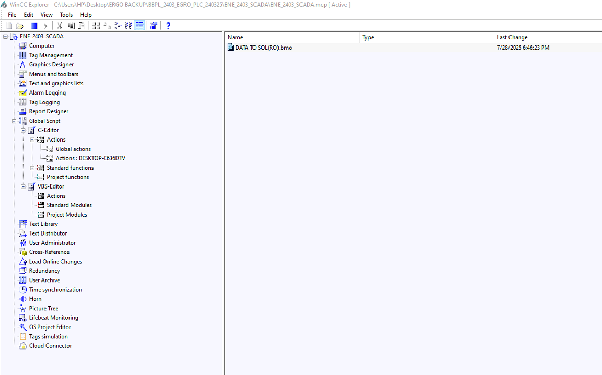

# SQL to Excel Report Generation

### Main Interface


## Overview
This project facilitates the generation of Excel reports from SQL Server databases using Python. The application is designed to work with WinCC SCADA systems and supports multiple table connections and column data setups.

---

## Steps to Configure and Use

### 1. Edit the `.bmo` File in WinCC
- Open the WinCC project.
- Locate the `.bmo` file (e.g., `DATA TO SQL(RO).bmo`).
- Make necessary edits to ensure proper data flow and compatibility with SQL Server.

### 2. Create Tables and Verify Data
- Use SQL commands to create tables in the database.
- Ensure the data is flowing correctly by testing with SQL queries.
- **Important:** When creating tables, use data types supported by WinCC. For example:
  - WinCC does not support `datetime`. Instead, use `varchar` for date and time columns.

### 3. Configure SQL Server
#### Create a New User
- Create a new user in SQL Server with SQL authentication.
- Assign a strong password and ensure the user has necessary permissions.

#### Database Server Settings
- Enable SQL authentication mode in SQL Server.
- Configure TCP/IP settings in SQL Server Configuration Manager:
  - Enable TCP/IP protocol.
  - Set the port to `1433`.

#### Permissions
- Grant the new user permissions to access the database and perform necessary operations.

#### Testing
- Test the new user configuration in SQL Server Management Studio.
- Verify the connection using PowerShell commands:
  ```powershell
  sqlcmd -S <ServerName> -U <Username> -P <Password>
  ```

### 4. Python Application (`SQL_to_REPORT.py`)
#### Database Connection Setup
- Configure the connection string to connect to the SQL Server database.
- Ensure proper handling of multiple table connections.

#### Column Data Setup
- Define column mappings and ensure compatibility with the table structures.
- Use `TRY_CONVERT` for robust handling of data types.

---

## Screenshots

### Excel Report Output


### WinCC Configuration


### SQL Server Settings


---

## Notes
- Ensure all configurations are tested thoroughly before deployment.
- Follow best practices for database security and data handling.

---

Developed by Subhajit Duttagupta
